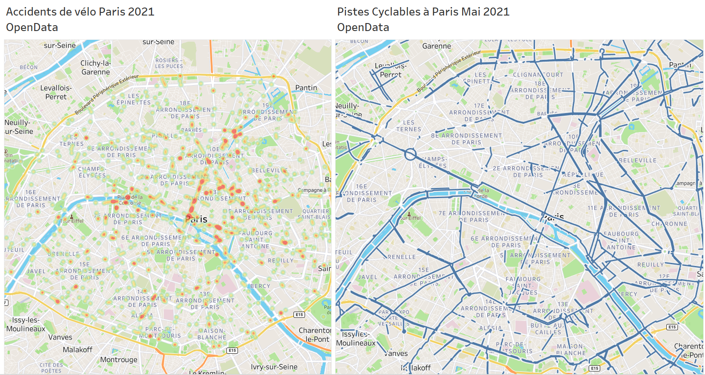

# **Bike Accidentology Paris**

A visualisation of bike accidents and bike infrastructure in Paris 2021

  

  

  

**Notes:**
- Serious injury means fatality or more than 24 hours spent in the hospital
- A dedicated lane and a bike path are separated from the road while a bike lane is on the road shared with other vehicles

**Tools used:**
- Tableau
- Pandas

**Sources:**
- Bases de données annuelles des accidents corporels de la circulation routière 2019-2021 [<a href="https://www.data.gouv.fr/fr/datasets/bases-de-donnees-annuelles-des-accidents-corporels-de-la-circulation-routiere-annees-de-2005-a-2021/" target="_blank">link</a>]
- Données du Baromètre des Villes Cyclables 2021 [<a href="https://opendata.parlons-velo.fr/" target="_blank">link</a>]
- Base Nationale des Aménagements Cyclables 2021/05/18 [<a href="https://transport.data.gouv.fr/datasets/amenagements-cyclables-france-metropolitaine" target="_blank">link</a>]